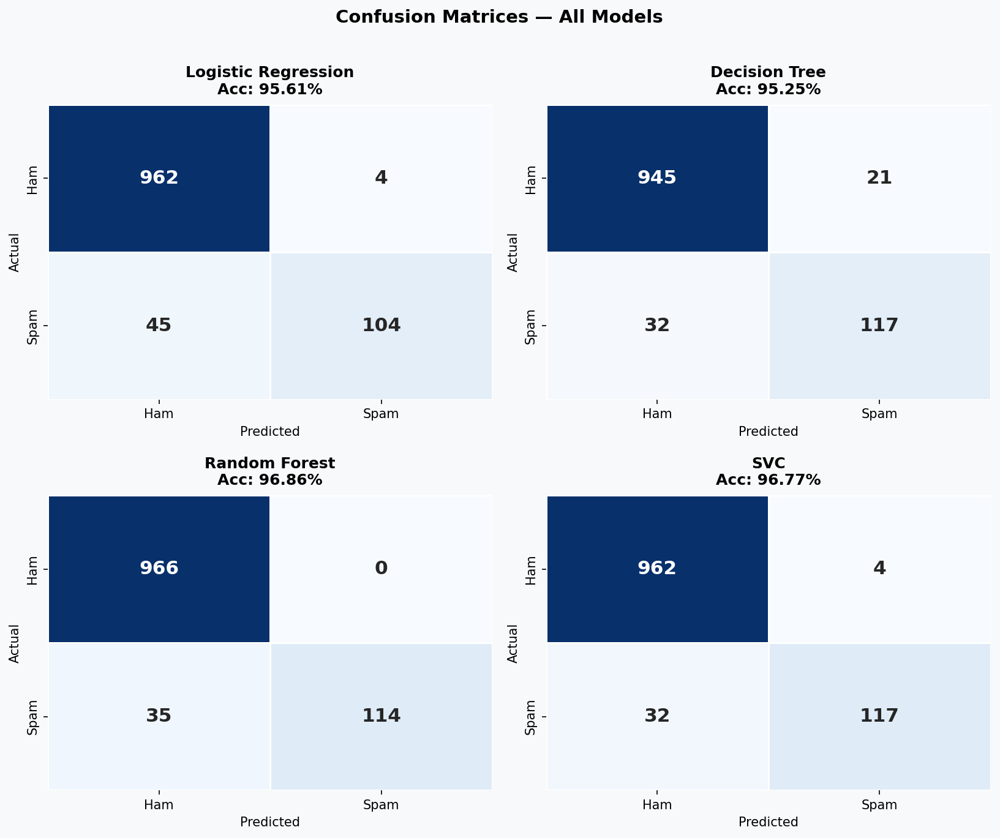
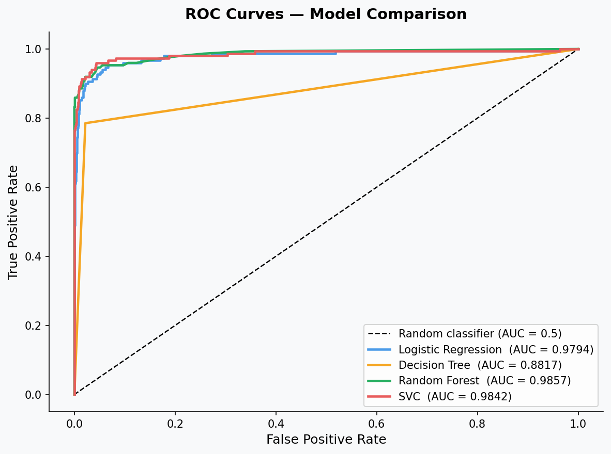
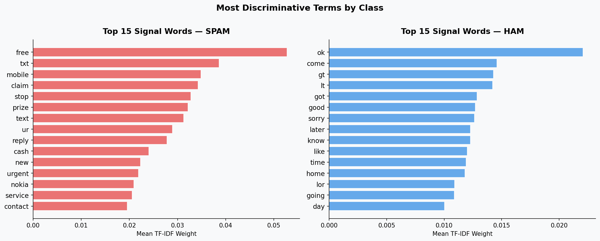

# Email Spam Detector


End-to-end NLP pipeline that classifies emails as **spam** or **ham** using a labeled email spam dataset (5,572 emails). Four classifiers are trained, evaluated, and compared — the best model is exported for inference.

---

## Results

| Model | Accuracy | Spam Precision | Spam Recall | Spam F1 | CV Score |
|---|---|---|---|---|---|
| Logistic Regression | 95.61% | 96.30% | 69.80% | 0.8093 | 95.06% |
| Decision Tree | 95.25% | 84.78% | 78.52% | 0.8153 | 95.85% |
| **Random Forest** | **96.86%** | **100.00%** | 76.51% | **0.8669** | **97.67%** |
| SVC (RBF) | 96.77% | 96.69% | 78.52% | 0.8667 | 97.22% |

**Random Forest** is selected as the best model. It ties near-top accuracy while achieving **zero false positives** — no legitimate email is ever mislabeled as spam.

> CV Score = 5-fold cross-validation mean accuracy on training set.

---

## Pipeline

```
spam.csv (5,572 emails)
   |
   +-- Text Cleaning
   |     lowercase -> strip URLs -> strip HTML -> remove punctuation/digits
   |
   +-- Tokenization (NLTK word_tokenize)
   |
   +-- Stopword Removal (NLTK English stopwords)
   |
   +-- TF-IDF Vectorization (6,537 features, 80/20 stratified split)
   |
   +-- Train & Evaluate (5-fold CV + held-out test set)
   |     Logistic Regression  ->  95.61%
   |     Decision Tree        ->  95.25%
   |     Random Forest        ->  96.86%  <- best
   |     SVC (RBF)            ->  96.77%
   |
   +-- Export
         best_model.joblib
         tfidf_vectorizer.joblib
```

---

## Outputs

Running the script generates the following in `output/`:

| File | Description |
|------|-------------|
| `class_distribution.png` | Class imbalance bar chart + email length distribution |
| `top_terms.png` | Top 15 TF-IDF signal words per class (spam vs. ham) |
| `confusion_matrices.png` | 2×2 heatmaps for all 4 models |
| `roc_curves.png` | ROC curves with AUC scores |
| `accuracy_comparison.png` | Test accuracy vs. 5-fold CV mean |
| `best_model.joblib` | Trained Random Forest classifier |
| `tfidf_vectorizer.joblib` | Fitted TF-IDF vectorizer |

---

## Visualizations

<table>
<tr>
<td></td>
<td></td>
</tr>
<tr>
<td align="center"><em>Confusion matrices — Random Forest shows 0 false positives</em></td>
<td align="center"><em>ROC curves — all models AUC > 0.97</em></td>
</tr>
</table>



*Top spam signal words ("free", "call", "claim", "prize") vs. common ham words*

---

## Quick Start

```bash
pip install -r requirements.txt
python spam_detector.py
```

Runtime: ~25 seconds on a standard laptop.

---

## Load the Saved Model

```python
import joblib
from spam_detector import clean_text

model = joblib.load("output/best_model.joblib")
tfidf = joblib.load("output/tfidf_vectorizer.joblib")

msg  = "Congratulations! You've won a FREE iPhone. Click to claim your prize."
pred = model.predict(tfidf.transform([clean_text(msg)]))[0]
print("SPAM" if pred == 1 else "HAM")
# -> SPAM
```

---

## Dataset

Labeled email spam dataset — 5,572 emails: **4,825 ham (86.6%)** / **747 spam (13.4%)**.
The dataset is imbalanced (~6.5:1), which is why spam precision and recall matter more than raw accuracy.

---

## Tech Stack

| Layer | Tools |
|---|---|
| Language | Python 3.11 |
| NLP | NLTK (tokenization, stopwords) |
| Feature extraction | scikit-learn TfidfVectorizer |
| ML models | scikit-learn (LR, DT, RF, SVC) |
| Evaluation | accuracy, precision, recall, F1, AUC, 5-fold CV |
| Visualization | matplotlib, seaborn |
| Model export | joblib |
